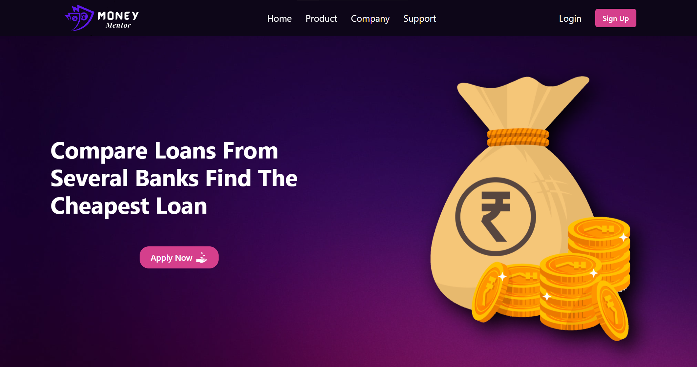

# Money Mentor 

Welcome to our <b>Money Mentor</b>! We are your one-stop destination for all your financial needs. Our platform offers a wide range of loan options, tailored to suit individual requirements. From personal loans to home mortgages, small business funding to student loans, we have partnered with reputable lenders to provide you with competitive interest rates and flexible repayment terms.

Our user-friendly interface ensures a smooth and secure application process, with quick approvals to get you the funds you need when you need them most. Our team of financial experts is ready to assist you at every step, offering personalized guidance and support.

Rest assured, your data is protected with the highest level of security measures in place. So, whether you're planning a major purchase, consolidating debt, or facing unexpected expenses, trust us to be your reliable financial partner. Start your journey towards financial stability and success today with our loan providing website.

# Tech Stacks

## For Deploying

- Live preview : https://money-mentor.netlify.app/

# Features
- Authentication
- Check Eligibilty
- Choose Loan by Category
- Select our Partner Bank
- Proceed With the loan Application
- Get Approved from Backend 

# Different Pages of Website
### Homepage

### Login

### Products

### Eligibilty Page

### Loan Application Process Page

### Support Page

## Our Collaborators
- Krishna Vaishnav (Team lead) - krishnavaishnav125@gmail.com
- Mohnish Vishwakarma - mohnish201@gmail.com
- Rohan Kumar - 00rohansah00.kr@gmail.com
- Nitesh Chandrakar - niteshchandrakar2@gmail.com
- Harshit Kumar - harshit007.ara@gmail.com 

### How to run the Project
### Install

Follow the following steps to get development environment running.

* Clone repository from GitHub

  bash
  git clone https://github.com/KrishnaVaishnav98/vogue-pocket-8479
  

   OR USING SSH

  bash
  git clone git@github.com:KrishnaVaishnav98/vogue-pocket-8479.git
  

* Install node modules

   bash
   npm install
   

### Starting front-end servers

* Build application

  bash
  npm start
  
---

-------------------------------ThankYou😊-----------------------------------------

